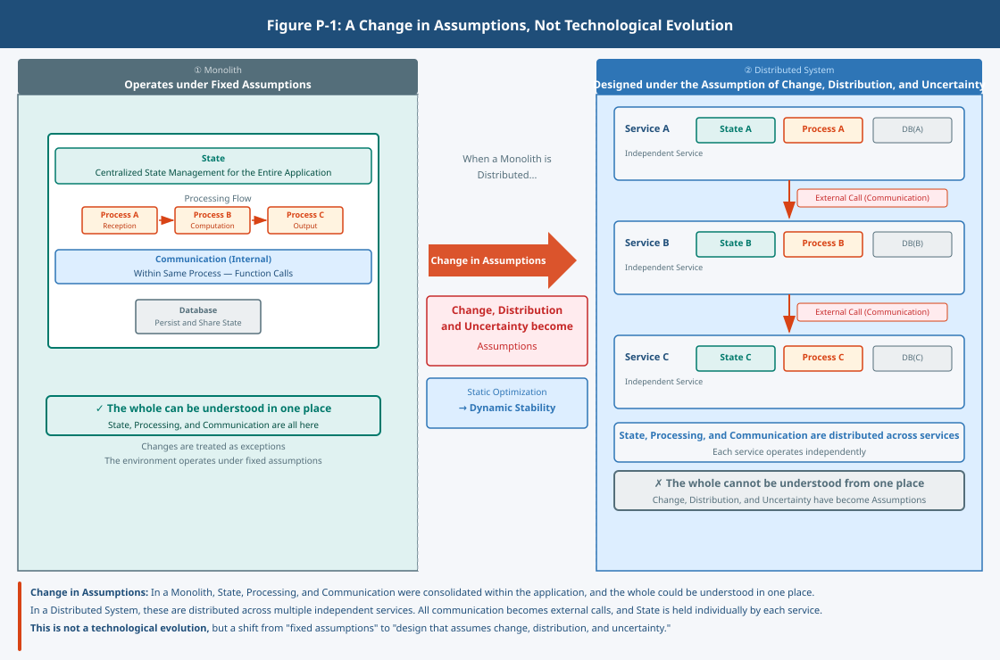

## What Is Cloud Native?

### 1. The Question

The term "cloud native" does not refer to a collective name for cloud services or container technologies.

Cloud is an environment structure that assumes change, scalability, and automation.  
Native means adapting to that environment and continuing to remain viable as a whole.

So, what is cloud native?

### 2. Background: Not Technological Evolution, but a Change in Assumptions

Monoliths remained viable under fixed assumptions.  
Virtualization separated environments, but the assumptions did not change.  
Containers made the unit smaller, but the whole was still managed by people.

In cloud native, the assumptions themselves changed.

This is not technological evolution.  
It is a change in the assumptions under which systems exist.

Traditional systems assumed that the environment would not change significantly.  
Configuration was fixed, and changes and failures were treated as exceptions.

Today, however, services change continuously,  
configuration is distributed, and the environment is no longer stable.

With change, distribution, and uncertainty now taken as assumptions,  
systems can no longer remain viable under the traditional assumptions.

### 3. The Core: From Static Optimization to Dynamic Stability

Traditional design was optimized under the assumption that change would not occur.  
Configuration was fixed, and failures and changes were treated as exceptions.

In cloud native, the assumptions are inverted.

Change is treated as something that always occurs,  
and configuration is designed under the assumption that it continues to move.

Here, one assumption must be made explicit.

Cloud-native design does not assume that things will not break.  
It does not assume that everything can be fully controlled.

Parts breaking, state drifting, environment changing —  
these are not treated as anomalies, but as assumptions.

Within that, the system is still required to continue to remain viable as a whole.  
The goal is not to prevent stoppage, but to ensure that the whole continues to remain viable even when parts stop.

Rather than supporting through operations, absorb through structure.  
Rather than avoiding change, treat change as an assumption.

Under this assumption, operations that rely on human judgment case by case cannot keep up.

Therefore, the judgment required to maintain viability  
is designed to be carried out by the structure, not by people.

### 4. The CNCF Definition

The CNCF definition of cloud native is widely referenced.

It cites containers, microservices, declarative APIs, and observability as examples,  
and emphasizes characteristics such as loose coupling, automation, scalability, and resilience.

However, this is only one way of organizing the concept.

This textbook treats these not as individual technologies,  
but as a structure that assumes change.

These are not individual technologies.

Containers are a means to isolate execution units.  
Microservices are a configuration to divide responsibilities.  
Declarative APIs are an interface for managing state.  
Observability is a mechanism for understanding state and enabling judgment.

All of these are positioned as elements that enable the system as a whole to continue to remain viable,  
within an environment that assumes change.

### 5. What Learning Makes Visible

When cloud native is understood from this perspective,  
the way systems are seen changes significantly.

Rather than individual technologies,  
what becomes visible is where change occurs and where viability is supported.

The center of design becomes not "making it run,"  
but "continuing to remain viable as a whole."

And judgment comes to be based not on function,  
but on structure.

This change is not simply the addition of a skill.  
It means that the assumptions about systems themselves change.

For example, when a problem occurs in which a service is slow,  
it may not be immediately possible to identify where the cause lies.

Is it a problem in the application?  
A problem in the network?  
Or a problem in the integration with another service?

Within a distributed structure,  
a single cause affects the system as a whole.

What matters in this situation  
is not knowledge of individual technologies.

It is understanding where change is occurring,  
and where viability is being supported.

This change is not simply the addition of a skill.  
It means that the assumptions about systems themselves change.

### 6. Summary

What has been addressed here  
is not an explanation of the term "cloud native."

It is a perspective on what assumptions to hold about systems.

When standing on this perspective,  
the way systems are seen and the approach to design change significantly.

How, then, is that structure realized?  
We hope you will proceed to the next part with this question in mind.
