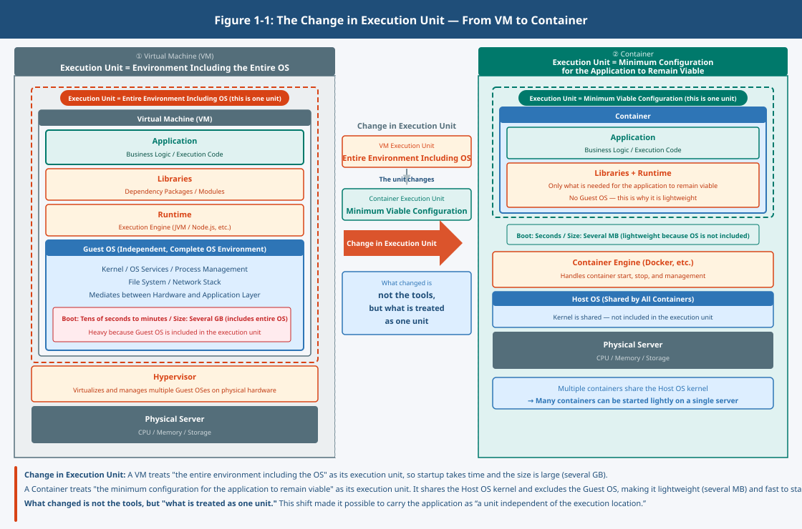

## Chapter 1: Container Basics and Docker – The Story of How the Execution Unit Changed

### 1. Why Was It Necessary to Reconsider the "Execution Unit"?

Applications were once treated as things that run on top of a specific environment.

The environment here refers to the collection of assumptions required for an application to run —  
such as the OS, dependent libraries, and runtime.

As environments multiplied, changes increased, and the need to run the same things the same way grew,  
those assumptions began to break down.

The problem was not the application itself.  
**It was that the assumptions under which it ran were dependent on the environment.**

For example, something that ran in the development environment  
would not run in the production environment.

- Library versions differed
- Configurations differed
- Dependencies were not aligned

The problem in this situation was not the code.

**It was that the assumed environment did not match.**  
What was called into question here was: at what unit should the application be treated?

### 2. What Virtualization Changed

Through virtualization, environments were separated from physical servers.

Environments could be duplicated, moved, and restored.  
Environments no longer needed to be fixed.

However, the way applications were treated did not change.  
The execution unit remained close to the environment.

Environments were isolated,  
but applications remained dependent on the environment.

In this state,  
"where to run" could be resolved,  
but "how to treat" had not changed.

**Therefore, it became necessary to change the unit of treatment itself.**

### 3. The Container as an Execution Unit

A container separates the execution unit from the environment.

What is handled is not the entire OS,  
but the minimum configuration required for the application to remain viable.

Through this distinction,  
an application is treated as a unit that does not depend on where it runs.

For example, if the same container is moved to a different environment as-is,  
it can be expected to run in the same way.

Rather than adjusting configurations for each environment,  
**the idea becomes carrying the viable state as a unit.**

Created when needed, discarded when no longer needed.  
The assumption becomes replacement, not maintenance of a fixed instance.

### 4. The Idea of Treating Something as a Unit

What changed with containers was not the tooling.

Applications came to be treated not as "things that run on top of an environment,"  
but as **units that contain their own conditions for viability.**

Rather than maintaining the environment,  
viable units are continuously replaced.

Through this distinction, the meaning of stability changes.

Stability is not the maintenance of a state.  
**It is a state of viability achieved through continuous replacement.**

### 5. The Role of Docker

The container mechanism itself is realized through Linux capabilities.  
Docker is the representative tool that made this mechanism accessible to everyone.

Through unified operations and a reproducible format, the container concept became widely applicable.

Through unified operations and a reproducible format,  
containers became a unit that individuals could handle.

Docker is not cloud native itself.

However, by making it possible to actually work with this unit,  
the idea of "treating applications as units" became a reality.

### 6. Containers and Microservices Are Separate Concerns

Containers address the execution unit.  
Microservices address division and responsibility.

How to operate a unit  
and how to divide a unit are different problems.

Conflating these two  
obscures the intent of the design.

Containers address "how to handle."  
Microservices address "how to divide."

The problems they address are different.

### 7. The Question That Remains

The execution unit has been separated from the environment  
and can now be treated as a small unit.

As a result, units increase in number, become distributed,  
and change and failure become assumptions.

Then, how are these ever-increasing units  
kept viable as a whole?
