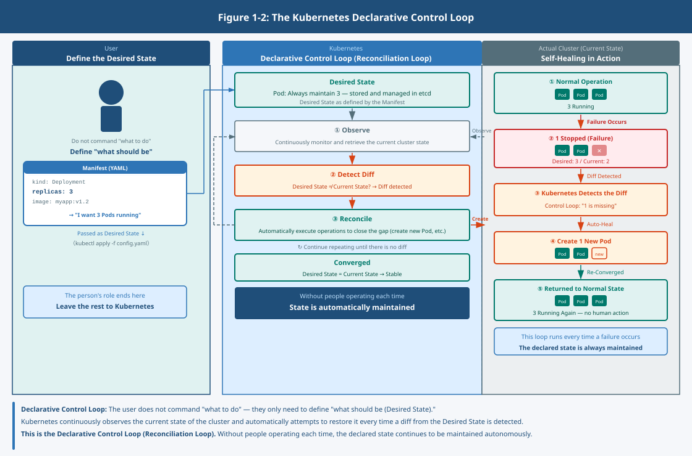
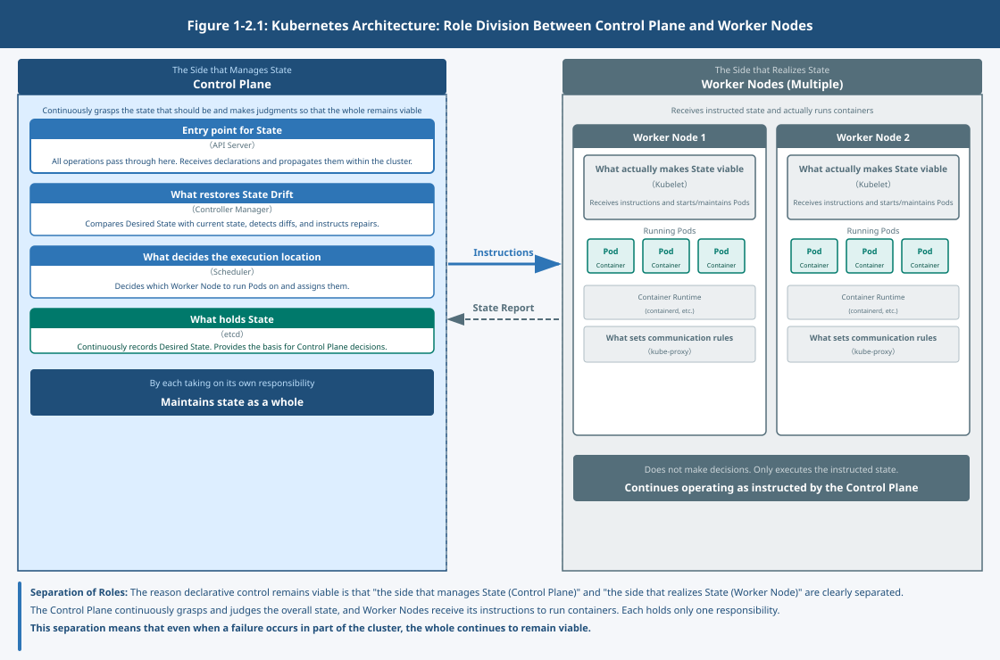

## Chapter 2: Kubernetes Overview and Key Components – The Story of Keeping Distributed Execution Units Viable

### 1. What Became a Problem in a World of More Containers?

With containers, applications could be treated as small units.

As a result, units increased, execution locations became distributed,  
and failure became not an exception but an assumption.

In this state,  
it is not realistic for people to manage each unit individually.

As the number grows,  
states diverge and understanding the whole becomes difficult.

What becomes a problem in this state is not the behavior of individual applications.

Who, and how,  
keeps these ever-increasing units viable as a whole?

### 2. What Does Kubernetes Take Responsibility For?

Kubernetes is a mechanism designed to address this problem.

What it handles is not individual containers.  
It is the state in which the whole remains viable.

Rather than people operating individually,  
maintaining the state in which the whole remains viable becomes the assumption.

Not where something is running,  
but what state it should continue to be in — that is what is addressed.

So that the state is maintained,  
scheduling, restarting, and adjustment continue to take place.

### 3. Managing State and Continuously Closing the Gap

Kubernetes treats the current state and the desired state separately.

Not "what to do,"  
but "what should be the case" is defined.

For example, even if one container stops,  
if the state "it should be running" is defined,  
it will be started elsewhere.

The actual state continues to change at all times.  
Therefore, a gap between actual and desired state always arises.

Kubernetes continues to observe that gap  
and continues to act to close it.

Rather than aligning once,  
it continues to restore under the assumption that drift will always occur.

### 4. The Side That Manages State and the Side That Executes

To address this problem, Kubernetes is designed to separate the role of managing state  
from the role of actually running applications.

To keep this mechanism viable, the roles are divided broadly into two.

The side that handles state and keeps the whole viable,  
and the side that actually runs applications.

The former understands the desired state,  
and continues to make judgments so that state is maintained.

The latter receives the resulting instructions  
and actually runs containers.

Through this separation,  
a structure is maintained in which even if a part changes, the whole does not collapse.

### 5. A Structure Divided by Responsibility

This is a design decision in the architecture of Kubernetes.

Within this structure, each role is further divided.

- What serves as the entry point for state
- What decides where to execute
- What detects and corrects drift
- What actually makes the state viable

Each holds only one responsibility  
and does nothing beyond that.

Through this separation,  
even if a failure occurs in part of Kubernetes, the cluster as a whole continues to remain viable.

### 6. Kubernetes Is Not an OS

Kubernetes is not an OS.

Because it can handle multiple machines together,  
it may appear that way.

In reality, however, it does not directly manage resources —  
it is responsible for the control required to maintain the desired state.

Execution itself is delegated to the OS and the mechanisms on top of it.

Kubernetes does not replace those.  
It is the layer that keeps the state viable on top of them.

### 7. The Question That Remains

Up to this point, the mechanism for keeping distributed units  
viable as a whole has come into view.

However, one more assumption remains.

Where are those units run?

Is the environment fixed, or does it change?  
How much is controlled by the team itself, and how much is left to the mechanism?

This assumption significantly changes the meaning of design.
