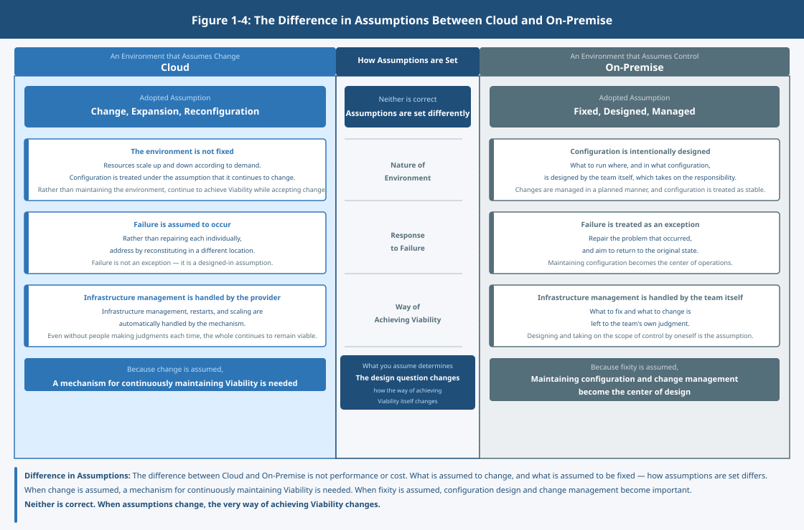

# Chapter 3: Characteristics of Cloud vs. On-Premise – Thinking About Where to Run as a Structure

## 1. Why Does the Debate Never Converge?

Discussions about cloud and on-premise often reach no conclusion.

This is not because one is superior to the other,  
but because the comparison is made without aligning on assumptions.

Even for the same system,  
whether change is assumed,  
or fixed state is assumed,  
changes the basis for evaluation significantly.

When assumptions differ, the appropriate design and judgment differ as well.

Note that the characteristics described here represent general tendencies. It is possible to adopt a fixed configuration on cloud, or to adopt a design that assumes change on-premise.

## 2. The Assumption of Cloud

Note that the cloud referred to here is in the sense of an execution platform,  
and should be understood separately from the design philosophy of cloud native.

Cloud is not a specific service or location.  
It is an environment that assumes change, scalability, and automation.

The environment is not fixed.  
It scales up and down as needed,  
and failure is treated as an assumption.

For example, as load increases, resources increase; when no longer needed, they decrease.

When a failure occurs, rather than repairing individual components,  
they are reconstructed elsewhere.

Rather than maintaining the environment,  
viability is maintained while accepting change.

## 3. The Assumption of On-Premise

On-premise is not the opposite of cloud.  
It is an environment in which the assumption is that you control it yourself.

Where it runs, in what configuration it runs —  
the responsibility for that is taken on by the team itself.

Configuration is intentionally designed,  
and changes are treated as managed events.

What to fix and what to change  
is left to the team's own judgment.

## 4. What Is Different?

The difference is not performance or cost.

What is assumed to change,  
what is assumed to stay fixed,  
and who takes responsibility.

The way assumptions are set differs.

When change is assumed, configuration is treated as something that continues to move.  
State changes constantly, and viability must continue to be maintained.

When fixed state is assumed, configuration is treated as something stable.  
State is maintained, and changes are treated as managed events.

Neither is correct.

When assumptions change,  
how viability is achieved changes as well.

## 5. Choosing an Assumption

Deciding where to run something  
is not a matter of choosing an environment.

It is a matter of deciding which assumptions to adopt.

Whether to accept change,  
or to control and fix.

That choice changes the meaning of design.  
What is assumed determines what problem is being addressed.

What is to be kept viable?  
How much is left to the mechanism?  
How much is taken on by the team itself?

The way those questions are framed changes.

## 6. The Question That Remains

The unit has been separated, and its viability has come to be controlled.  
And the envi
