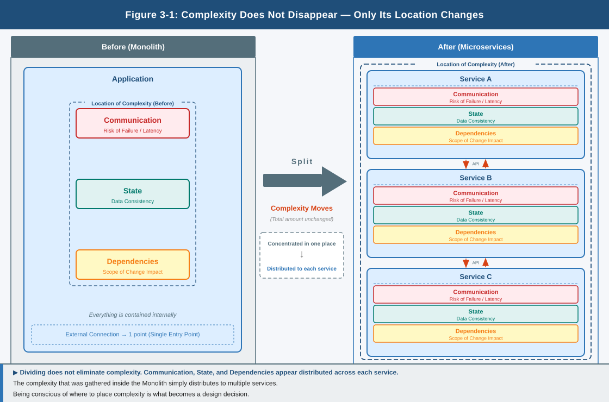

# Chapter 1: Microservices and Application Configuration – What Happens When You Divide?

## 0. How Assumptions Are Set

This chapter does not address specific configurations or correct answers.

The way applications are divided changes depending on the assumptions in place.  
What is addressed here is not which form is correct.

**Why does the idea of division emerge?**  
**What happens when things are divided?**

That structure is what is addressed.

## 1. Why Does Division Appear?

What is addressed here is the application.

Processing that provides functions to users is configured as a single body.  
However, as change increases, the situation changes.

- The frequency of changes increases
- The number of functions handled simultaneously increases
- The amount of processing exchange increases

What flows through the system continues to grow.

**The flow of change**  
**The flow of communication**

In this state, a single change affects the whole,  
and the whole must be handled every time a change occurs.

Even fixing just a part may require stopping the whole.  
At this point, "continuing to handle things as a single body" becomes unrealistic.

What emerges here is the question: "Where do we draw the boundary?"

## 2. What Happens When Things Are Divided?

When an application is divided,  
each part can be handled as an independent unit.

- Only a part can be changed
- Only a part can be run

However, at the same time, each part can no longer remain viable on its own.

When processing that was inside a single body is separated,  
the need to connect what has been separated emerges.

One process calls another, one state is held in a different place,  
and returning a result comes to span multiple units.

In other words, the moment of division is when **communication, state, and dependencies** emerge on the outside.

There are aspects that become easier to handle through division.

However, at the same time, a new problem emerges:  
how to keep what has been divided viable together.

## 3. Complexity Moves

Division is not an act of reducing complexity.  
**It is an act of relocating complexity.**

What was inside a single body emerges on the outside through division.

- Communication
- Change
- Dependencies

These come to be handled outside the divided units.

As a result, things that did not need to be considered before  
now emerge as objects to be handled.

- Communication is delayed and fails
- State drifts and inconsistencies arise
- Dependencies expand the scope of impact

These are not exceptions.  
**Division brings assumptions to the surface**

## 4. Division as Responsibility

An application can be understood as a collection of responsibilities.

- Interaction with users
- Processing
- Data retention

The division itself is not what matters.

**How far to treat as a single unit, and where to divide responsibility**

This choice changes how things are handled.  
Treating as a single unit means changes are made collectively.  
Treating separately means a part can be handled independently.

However, at the same time, the need to connect what has been divided emerges.

The division changes what problems must be addressed.  
**This judgment becomes the design itself.**

## 5. Division and Execution Environment

Divided units do not remain viable on their own.  
Each runs in a different place, and each changes independently.

Some increase,  
some decrease,  
some fail,  
and some are restarted elsewhere.

In order to maintain this state, judgments are constantly required:

- Where to run
- When to run
- How to connect

If all of this were handled by people, the state would need to be confirmed at every change  
and the necessary operations would need to be performed each time.

**This state is not realistic**

Therefore, a mechanism for continuously managing these things becomes necessary.  
It is here, for the first time, that a mechanism such as Kubernetes takes on meaning.

**Division reveals where responsibility must be placed**

## 6. A Choice, Not a Correct Answer

It is here, for the first time, that the term "microservices" takes on meaning.

Microservices is not a form to aim for.  
**It is a design choice.**

The optimal form changes depending on what assumptions are in place.  
What matters is not division itself.

As a result of division:

- Which responsibilities are taken on
- Which changes are accepted
- How far control extends

That understanding is what matters.

## 7. The Question That Remains

Through division, the flows of change and communication have emerged.

Change is not something delivered once and finis
