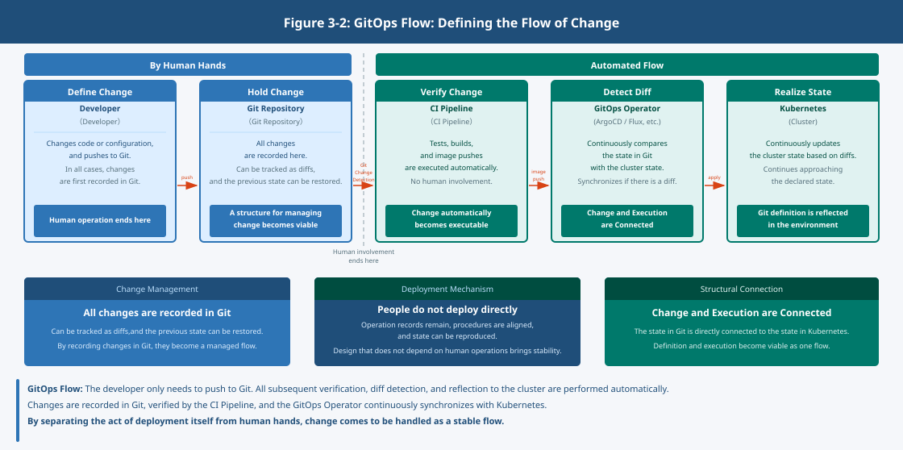

## Chapter 2: Continuous Delivery and GitOps – Continuously Delivering Changes

### 1. Why "Deploy Once and Done" No Longer Works

In traditional systems, deployment was an event.  
A release date was set, procedures were confirmed, and changes were applied.

This approach remained viable in environments where change frequency was low and the scope of impact was limited.  
However, when applications are divided and the unit of change becomes smaller, this assumption breaks down.

Small changes occur frequently, and it becomes necessary to continuously track "who changed what, and when."  
An increase in changes means a corresponding increase in the possibility of State Drift.

- Unintended changes become mixed in
- The state that is currently applied becomes unclear
- Returning to a previous state becomes impossible

Changes are not always applied correctly.  
**Change is also an uncertain flow**

### 2. Continuous Delivery Is Not "Automation"

Continuous delivery is often equated with "automated deployment."  
However, that is not its essence.

The problem is that every time a change occurs, a person must make a judgment,  
confirm the procedure, and continue aligning state.

In this situation, the higher the frequency of change, the more unstable operations become.

Human operations fluctuate,  
procedures shift subtly,  
and results become unreproducible.

**The harder people try, the more unstable things become**

What Continuous Delivery aims for is:

- Being able to apply changes through the same procedure at any time
- Being able to reproduce state
- Being able to restore when a problem occurs

In other words, **creating a state that remains viable without requiring human judgment each time**

### 3. Why the Structure Becomes "People Do Not Deploy Directly"

In cloud-native environments,  
a structure that does not make deployment dependent on human operations becomes the standard.

This is not because people are untrustworthy.

In an environment where changes have increased:

- Records of operations are not retained
- Procedures are not aligned
- State cannot be reproduced

These problems are unavoidable.

What matters is not "who did it" but **"what was done"**

Therefore, **a design is chosen that separates the act of deployment itself from human hands**.
 
### 4. The Idea of GitOps

One way of organizing this challenge is GitOps.

In GitOps, the Desired State of the environment is defined in Git,  
and a structure is taken in which the actual environment is continuously brought closer to that state.

What matters here is not the tool.  
It is how change is handled.

- All changes are recorded in Git
- They can be compared as a gap
- It is possible to return to a previous state

**A state is created in which the flow of change can be traced**

Git is used because **it exists as a structure for managing change**

### 5. The Relationship Between Kubernetes and GitOps

Kubernetes is a foundation on which the Desired State can be defined declaratively.  
The desired state is described, and the gap with the current state continues to be closed.

This property aligns with GitOps.

Kubernetes continuously brings the actual state closer to the state defined in Git.  
**Change and execution become connected**

This structure is in fact also implemented as tooling.

ArgoCD and Flux compare the state in Git with the state of the cluster,  
and keep this structure viable by continuously synchronizing the gap.

What matters is not the difference between tools.  
**The fact that this structure is viable**

### 6. The Meaning of Continuous Delivery

As seen up to this point, in an environment where change has increased,  
it is not realistic for people to continue making judgments each time.

Therefore, by defining state, fixing the flow of change,  
and having a mechanism for applying it, **judgment is shifted to the mechanism**

### 7. The Question That Remains

What has been addressed up to this point is the flow of change.

Applications are updated,  
state is rewritten, and it is reflected in the environment.

However, in a divided system, there is one more flow.  
Services call one another and exchange processing.

**It is the flow of communication.**

The flow of change has been organized.  
Then, how is this communication handled?
