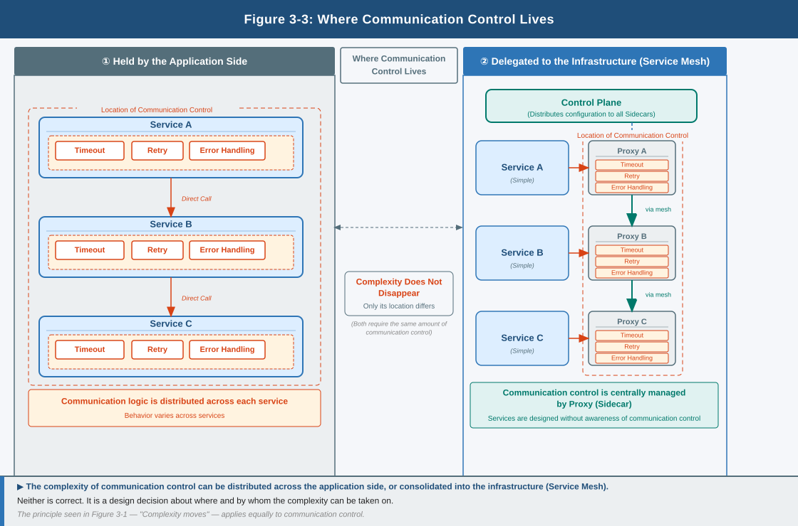

# Chapter 3: Inter-Service Communication Control – Where to Take Responsibility for Complexity

## 1. The Moment of Division Is When Communication Becomes a "Design Problem"

Within a single application, communication is barely considered.  
However, when an application is divided, this flow becomes communication over a network.

Network communication always carries the following assumptions.

- The possibility of not reaching its destination
- The possibility of latency occurring
- The possibility of the other side not responding

**Communication carries the assumption of failure**

From this moment, communication becomes an object to be treated as a design concern,  
not as an implementation detail.

When the behavior of communication is left to each service,  
behavior diverges and identifying causes becomes difficult.

**Communication, if left unattended, becomes uncontrollable**

Communication may succeed,  
fail,  
or be delayed.

The behavior of communication is a rule for how to act in situations such as success, failure, and latency.

## 2. Communication Control "Always Takes Place Somewhere"

The option of "not controlling" inter-service communication does not exist.

Judgments such as timeout, retry, and error handling  
are always taking place somewhere, whether or not one is conscious of it.

The problem is where they are being taken on.

In the code of each service, in a shared library, or on the infrastructure side —  
communication control already exists. It is simply not visible.

## 3. Complexity Does Not "Disappear" — It Moves

When communication control is taken on by the application side, behavior becomes clearer.  
However, similar implementations multiply and unifying behavior becomes difficult.

When communication control is moved to the infrastructure side, code becomes simpler.  
However, complexity appears in a different form: understanding configuration, visualizing behavior, and isolating failures.

Designing communication control is not eliminating complexity —  
it is deciding where to place it.

It is in this context that the idea of a **Service Mesh** emerges.

## 4. Not "Whether to Introduce" but "Whether It Can Be Taken On"

The question of this chapter is not "whether to introduce a Service Mesh."  
The essential question lies in the following points.

- Who understands this complexity of communication control?
- How far can it be traced when a failure occurs?
- Can it be taken on as an organization?

What is technically possible  
and what can be taken on as an organization do not necessarily align.

**What cannot be understood cannot be operated**

This structure is in fact also implemented as tooling.

Istio and Linkerd  
are implementations for moving communication control to the infrastructure side.

What matters is not the difference in functions.  
**The fact that communication control is separated out as a structure**

## 5. The Question That Remains

What has been examined up to this point is the flow of communication.

Services are divided,  
they call one another,  
and exchange takes place over a network.

However, what is being addressed here  
is only the structure of "where to control."

**The behavior of communication is a rule for how to act in situations such as success, failure, and latency.**

How is it defined,  
how is it controlled,  
and
