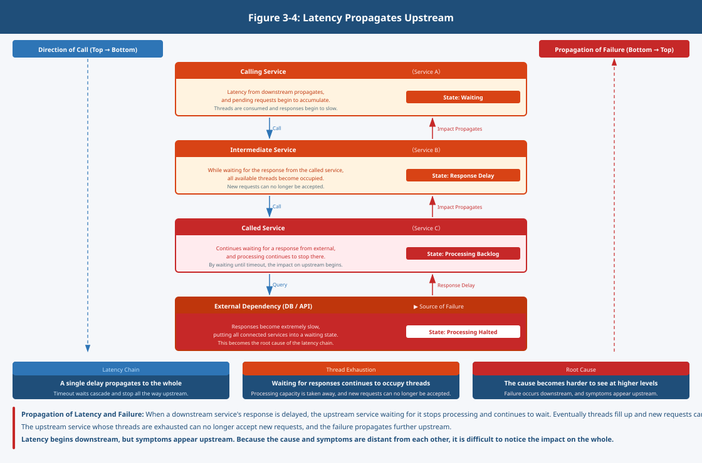

## Chapter 4: How to Handle the Behavior of Communication – Retry, Timeout, Observability

### 1. Communication "Appears as a Result"

In Chapter 3, where communication is controlled was examined.  
However, what actually appears is not the configuration itself but its result.

Communication appears in the form of:

- Succeeding
- Failing
- Being delayed

**Communication can only be observed as a result**

### 2. Communication Without Defined Behavior Becomes Unstable

Communication carries the assumption of failure.

However, if it has not been decided what to do when failure occurs,  
behavior will not be consistent.

- Some services retry
- Some services fail immediately
- Some services continue waiting for a long time

**The same failure produces different results**  
This is a state in which communication is not controlled.

**Communication without defined behavior becomes unstable**

### 3. Behavior Is Defined as a "Rule"

The behavior of communication is defined as a rule.

- How long to wait
- How many times to try
- At what point to give up

All of these **decide how to act when failure occurs**  
What is important here is that **it is behavior at the time of failure, not success, that determines the design**

### 4. Retry and Timeout

Among the behaviors of communication, the two most fundamental are:

- Retry
- Timeout

Retry re-attempts failed communication.  
Timeout decides how long to wait.

Without these:

- Failure spreads immediately
- Continued waiting causes processing to back up

**The system as a whole becomes unstable**

### 5. What Cannot Be Seen Cannot Be Controlled

The moment communication leaves the system, it becomes invisible.

- Where is it slow?
- Where is it failing?
- What route is it taking?

If these cannot be determined, the behavior cannot be adjusted.  
**What cannot be seen cannot be controlled**

### 6. The Idea of Observability

In order to handle communication, it is necessary to understand state,  
trace the flow, and identify the cause.

The idea for this is Observability.  
Observability is not a tool.

**It is the assumption required for understanding behavior**

### 7. Where Is Behavior Taken On?

These behaviors can be:

- Held by the application
- Held by the infrastructure side

Neither is correct.

**It is a design decision of where to take responsibility**

### 8. Summary

What has been examined in this chapter is the behavior of communication.

Communication appears as the results of:

- Succeeding
- Failing
- Being delayed

What matters is whether it has been decided  
how to act in response to those results.

Up to this point, the structure of:

- Division
- Change
- Communication
- Behavior

has come together.

Then, on top of these assumptions, how is the whole made viable?  
This is organized in the Part 3 summary.
