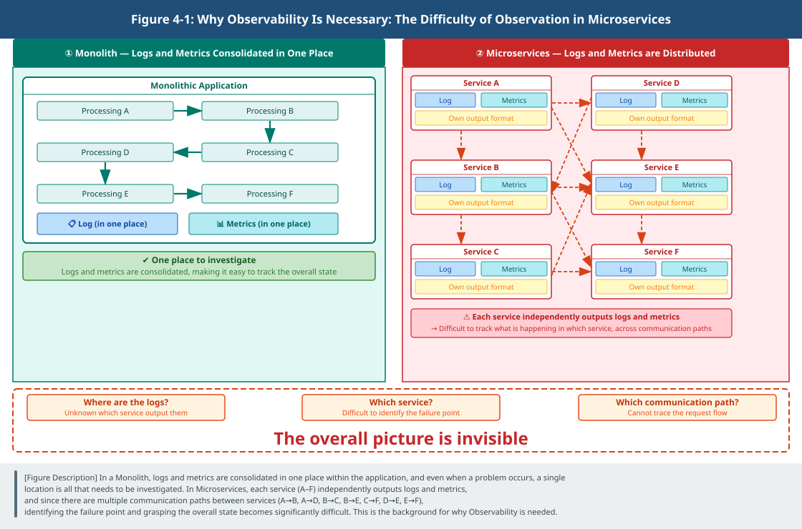
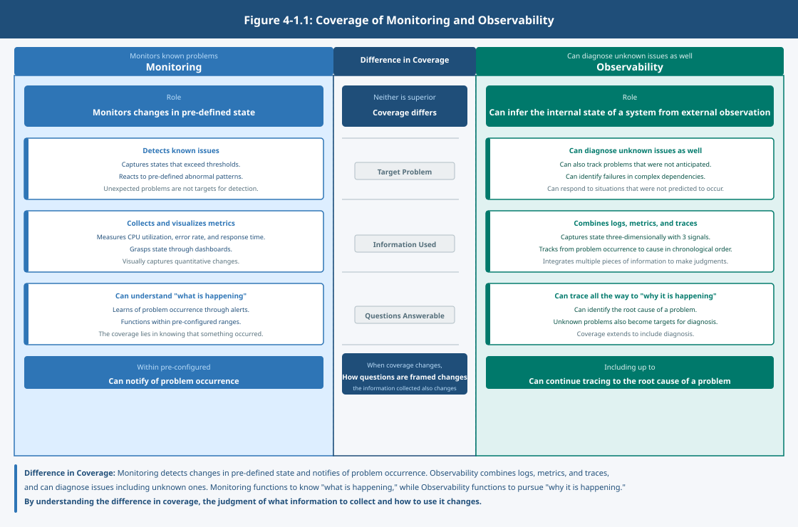

# Chapter 1: Monitoring and Observability – Visibility Alone Is Not Enough for Judgment

## 1. The Moment of Distribution Is When "The Whole Becomes Invisible"

In a single application:

- State is gathered in one place
- Logs provide answers
- Metrics allow understanding

However, this is viable only because everything is operating as a single body.

When an application is divided:

- Changes can be made flexibly
- Only a part can be updated
- Scaling can be done independently

At the same time, state becomes distributed.

Multiple services operate, and each holds state independently.  
Some processing spans multiple services, and results are returned over a network.

From this moment, the state of the system can no longer be grasped in one place.

## 2. The State of "Visible but Not Understandable"

Even in a distributed system:

- Information exists
- Logs are being output
- Metrics can be obtained

However, those are fragmented.

This is because each service operates independently  
and outputs information in different places at different times.

- An error is occurring in one service
- A delay is occurring in another service
- Resources are under pressure in yet another place

Each can be observed,  
but how they connect as a single problem is not clear.

## 3. Observation Is Possible, but Judgment Is Not

Having information and being able to make judgments are different things.

Even with a large volume of logs, the cause cannot be identified.  
Even with complete metrics, where the problem lies cannot be determined.

Fragmented information carries no meaning on its own.

Only by connecting how those things relate to one another  
does the state of the whole become visible.

## 4. From "Seeing" to "Judging"

What is needed here is not an increase in information.

What matters is  
whether state can be inferred from observed information.

- Where is latency occurring?
- Which processing is the bottleneck?
- Which change is having an impact?

Only by being able to make these judgments  
does stable operations first become viable.

## 5. What Is Observability?

Observability is not seeing everything.

It is the property of being structured so that the internal state of a system  
can be inferred from observable information such as logs, metrics, and traces.

It is not a matter of collecting all information —  
it is a matter of being in a state where information necessary for judgment can be handled.

In real operations, observation also has a cost.

- Too many logs and they become unreadable
- Too many metrics and they become unmanageable
- Too many traces and system load increases

Therefore, Observability is also  
a design for deciding **how far to observe**.

## 6. The Difference from Monitoring

Monitoring watches pre-determined indicators.

- CPU utilization
- Response time
- Error rate

It is possible to detect signs of abnormality.  
However, it cannot respond to problems that were not anticipated.

Observability is the assumption required for inferring state from observed information.  
Tools are merely means that support this observation.

- Prometheus collects metrics
- Grafana visualizes them
- Cilium observes communication state

What matters is not the tools.  
It is the judgment of what to observe.

## 7. The Questi
