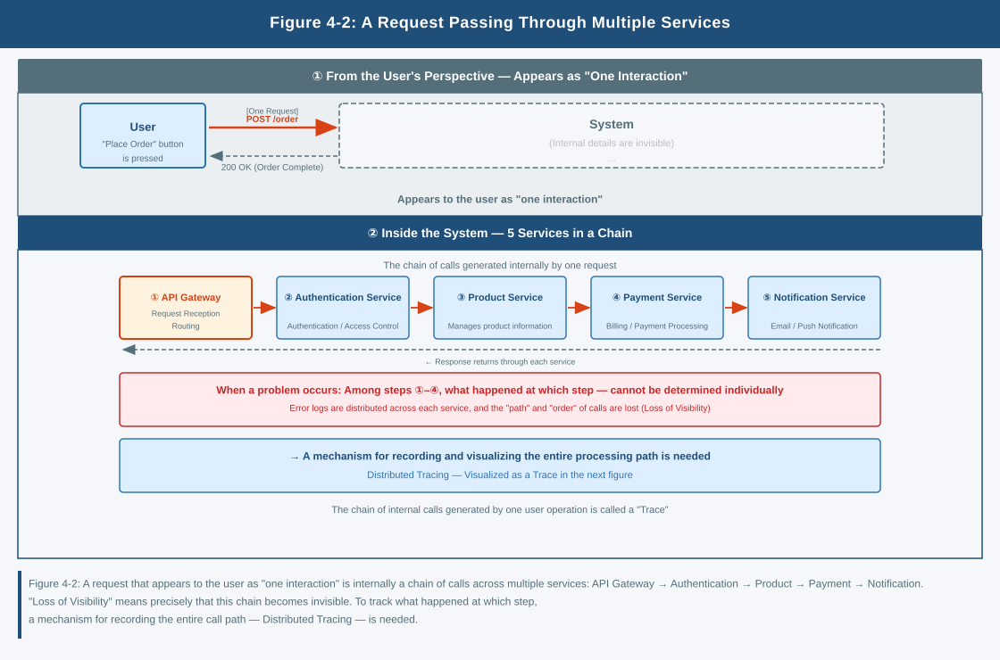
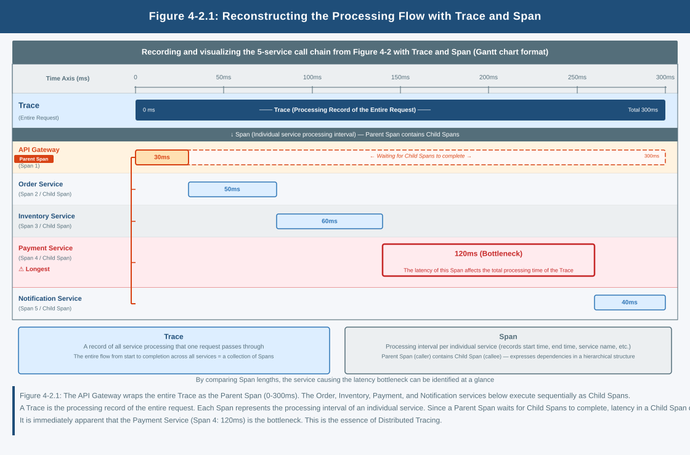

## Chapter 2: Tracing and Visualization of Distributed Systems

### 1. Problems That Occur in Distributed Systems

What is addressed here is an application divided into multiple services.  
Each service operates independently, and together they make a single function viable.

In a microservices environment, a single request is processed through multiple services.

- An API service receives the request,
- An authentication service performs authentication,
- A data service accesses the database.

For example, in an e-commerce site:

- An order service accepts order information,
- A payment service handles payment processing,
- A notification service reports the result to the user.

Even though it appears to the user as a single purchase operation, internally multiple services are coordinating to advance the processing.

In this structure, processing does not complete in one place.

- Where is processing slowing down is unknown
- Which service is experiencing an error is unknown

Each service can be observed.

However, how they connect as a single request is not clear.

In this state:

- Even when a problem occurs, the cause cannot be identified
- Even when a response is taken, reproducibility cannot be maintained
- The same failure repeats

Without understanding the flow of processing, the system cannot be operated stably

### 2. The Idea of Distributed Tracing

What addresses this problem is distributed tracing.

It makes it possible to track how a single request  
was processed within the system.

- Which services the request passed through
- How long each service took

By treating these as a single flow,  
the whole of the processing is visualized.

- Where latency is occurring
- Where errors are occurring

These can be identified at the level of a single request.  
However, it does not mean that every request should be traced.

Data volume continues to grow, storage costs increase,  
and system load is also affected.

**Tracing is not about tracing everything —  
it is a design for deciding how far to trace**

### 3. The Structure of Trace Data

In distributed tracing,  
processing information for requests is recorded as traces.

A Trace represents the overall flow of a single request,  
and a Span represents the processing in each service.

By recording the processing that occurred in each service as Spans  
and associating them as a single Trace,

processing that was fragmented  
is reconstructed as the flow of a single request.

### 4. The Role of Representative Tools

■ Jaeger  
Jaeger is a tool for collecting and storing trace data  
and visualizing the flow of processing.

■ OpenTelemetry    
OpenTelemetry is a standard specification  
for handling observation data such as logs, metrics, and traces in a unified way.

What matters is not the tools.

- **Which processing to trace**
- **At what granularity to observe**

That judgment is what matters.

### 5. The Question That Remains

Is it sufficient to be able to trace the flow of processing?

- Which requests to trace
- At what granularity to record
- Which information to retain

How does the design of observation become viable?

